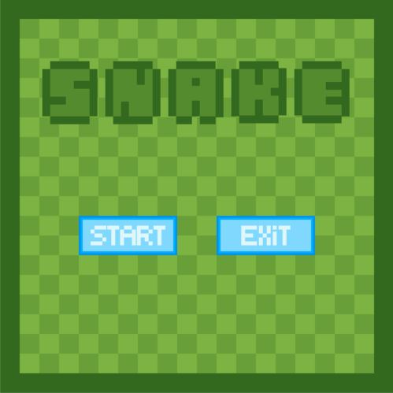
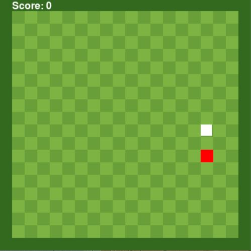
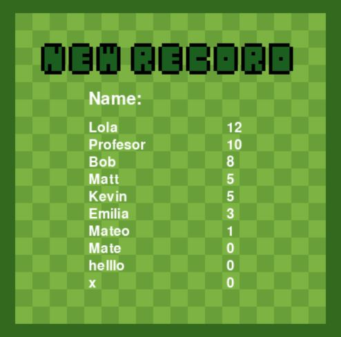

# Normal Snake

## How to play

When you first launch the game you will be greeted with this screen. 

Here you can choose to play by pressing "Start" or exit the game by pressing "Exit". *Note: you can also exit the game at any time by pressing the **ESC** key.*

By starting the game you will be presented with this screen.

Once the game starts the objective of the game is to eat as many apples (**red squares**) as you can without bumping into the walls or into your own body.

You can move using the **arrow** keys.

Once you bump into the walls or there is no more space to move you will eventually lose. When this happens you will be taken to the high scores tab.

Here you can type your name and if you are in the top ten players with the best score, your name and record will be shown every time you get to this screen.

Once you have typed your name, press ***enter*** and you will be taken to the Main Menu.

