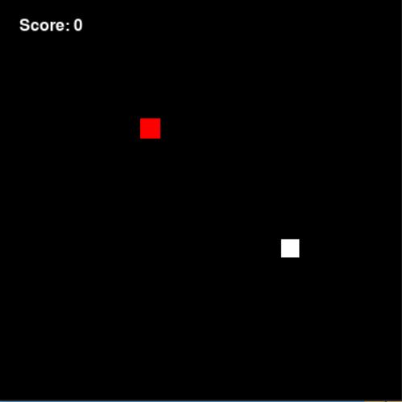

# Snake AI

***Note: This is my first project within the field in AI. Previous to this, I really didn't know much about AI and I still had a lot to learn. Said this, the agent and model in this project are far from perfect and the current high score achieved by this AI is 8 😑. After a bunch of training sessions I don't really think the model is 'learning' so I'm currently working on learning a few more things about deep q learning so I can better the model.***

## How to play

For this to play, it is a simple as locating yourself in this folder (*Snake_AI*) and running this command.

```powershell
python playAI.py
```

This version of the game lacks all the menus and textures of the 'Normal_Snake' version. So, by running this file you should be presented with something like this.

